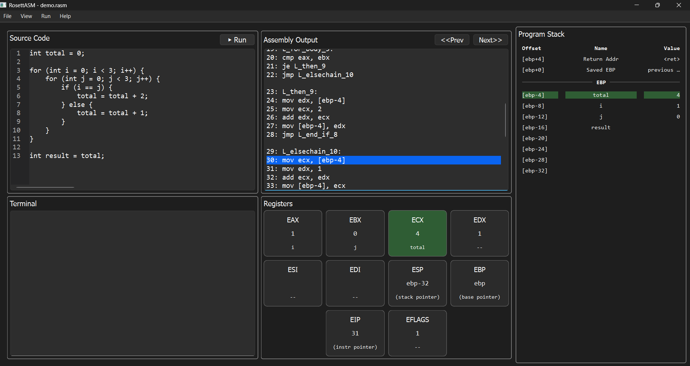

# RosettASM

RosettASM is a pedagogical programming environment for visualizing how high-level code executes at the machine level.

## Demo



The system visualizes step-by-step execution, showing how high-level code maps to assembly while tracking register and stack state in real time.

## Features

- Custom high-level language
- Compilation to x86 assembly
- Step-by-step execution visualization
- Register and stack tracking
- Interactive GUI built with PyQt

## Installation & Running

### Option 1: Executable
Download the latest release and run `RosettASM.exe`.

### Option 2: From Source
```bash
pip install PyQt6 QScintilla
python launch_rosettasm.py
```

## Usage

See full guide:
- [How to Use](rosettasm/docs/how_to_use.md)
- [Language Specification](rosettasm/docs/language_spec_v1.md)

## Project Structure

- `rosettasm/` – core compiler, UI, and execution engine
- `launch_rosettasm.py` – application entry point
- `rosettasm/docs/` – documentation files

## Technologies

- Python
- PyQt6
- QScintilla
- x86 Assembly (educational model)

## Motivation

RosettASM was designed to help students understand how high-level code translates to machine-level execution by making program behavior visible and interactive.

## Dependencies & Licensing

This project uses the following open-source libraries:

- PyQt (GPL licensed)
- QScintilla (GPL licensed)

RosettASM is distributed with source code in compliance with GPL requirements.

For more information:
- https://www.riverbankcomputing.com/software/pyqt/
- https://www.riverbankcomputing.com/software/qscintilla/

## License

This project is licensed under the GPL-3.0 License.

This project uses GPL-licensed dependencies (PyQt and QScintilla) and is distributed in compliance with their terms.
